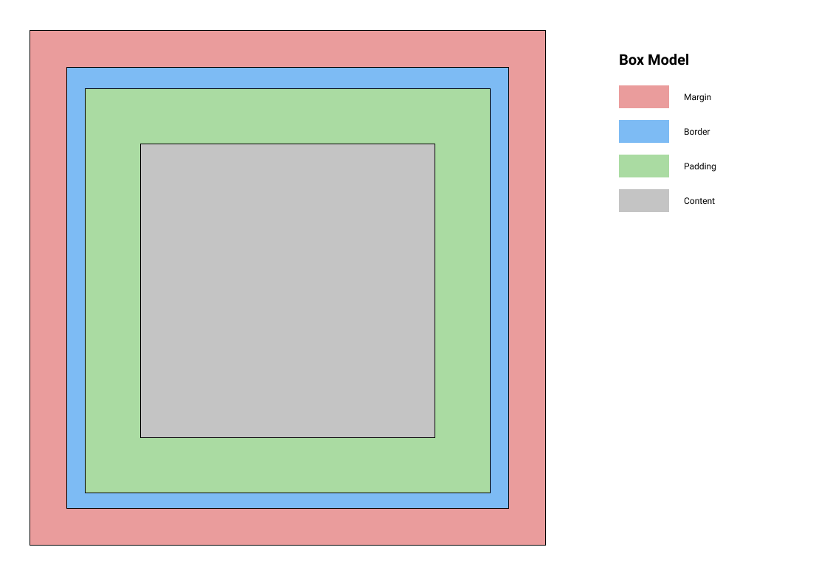
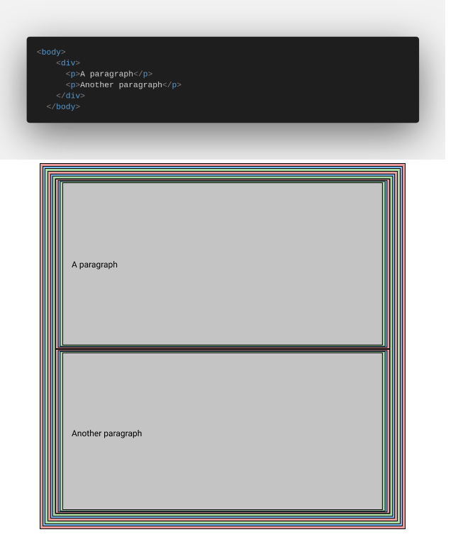

# CSS3

In this section i'll put everything i know with CSS from simple selector to complex uses of flexbox and CSS grid.

Syntax

Selectors

Box Model

The box model is the representation of each element that is rendered in the DOM tree. When you use an element such as a `div` or `p`, those elements are rendered using the box model.

Here an exemple with code

Properties

Interactions & Animations

Flexbox

CSS Grid

MediaQueries & Responsivity

---

### Resources

Here are the resouces that will explain this better.

- [W3C](https://www.w3schools.com/css/default.asp)
- [W3](https://www.w3.org/Style/CSS/Overview.en.html)
- [CSS-Tricks](https://css-tricks.com/)
- [MDN](https://developer.mozilla.org/en-US/docs/Web/CSS)
- [TutorialsPoint](https://www.tutorialspoint.com/css/index.htm)
- [Traversy Media (Youtube)](https://www.youtube.com/watch?v=yfoY53QXEnI)
- [Box Model W3](https://www.w3.org/TR/CSS2/box.html#box-padding-area)
