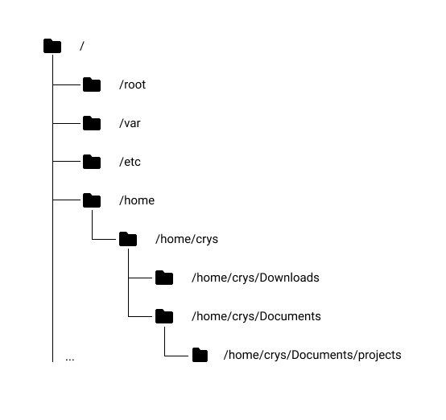

# OSs & Linux

Here will be all the knowledge i have about OS and Linux because it's the OS i use the most. The first thing to know about commands is that when you open a terminal it runs a shell. It is used to allows you to interact with your computer using commands.

Here is a representation of the tree structure in linux and how i see it when i run commands.

I'll keep that structure to explain each of the following commands.

<detail>
**Linux Commands**

- cd
- mv
- mkdir
- rmdir
- pwd
- ls
- rm
- man
- cp
- mv
- grep
- awk
- sed
- lsof
- curl
- wget
- tail
- head
- less
- find
- ssh
- kill
- ps
- tree

</detail>
