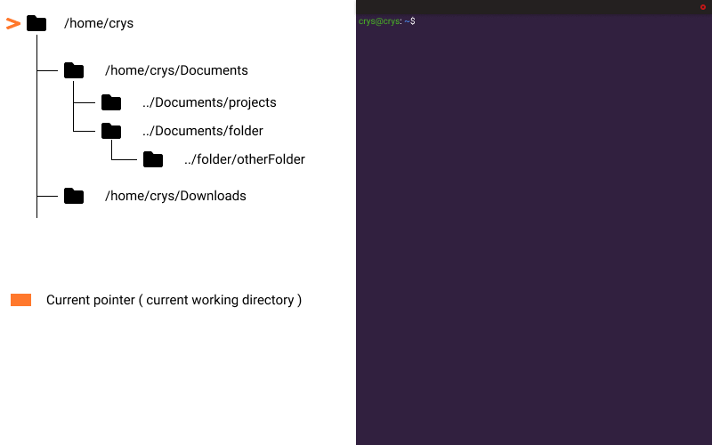

# Linux Commands

<detail>
**cd**

cd is a command that allows you to move your current cursor in the tree structure. You can either go up or down in the tree to do things in other folders. To go down, which means go inside a folder that is located in your current folder pointer : `cd subfolder/subsubfolder`. To go up or go outside of your current folder : `cd ../../`. ( `../` means going one directory up. `../../` means two directory up. etc... ).

</detail>
